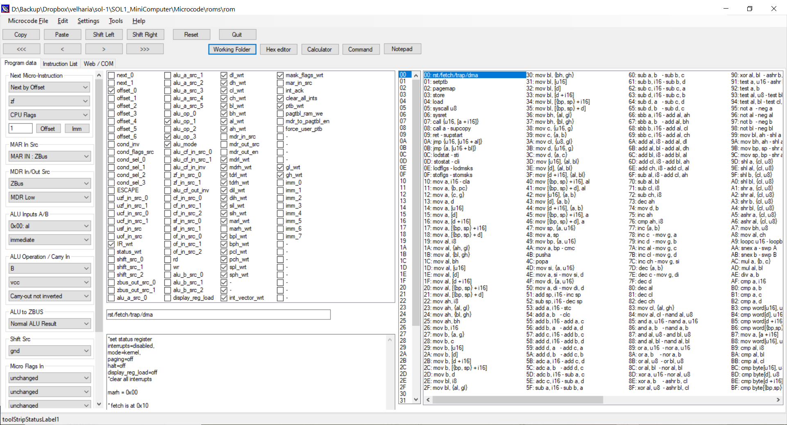

# Sol-1 Microcode Editor for Sol-1 HomebrewCPU Minicomputer System

This is a microcode editor for Sol-1 HomebrewCPU Minicomputer - A complete CPU and Minicomputer built from scratch in 74HC logic, created by Paulo de Tarco Constantino Junior (http://sol-1.org). Sol-1 project is inspired by [Bill Buzbee's work](http://homebrewcpu.com) on the [Magic-1 Minicomputer](http://www.magic-1.org/)

The original computer softwares (bios, kernel, sample assembly language programs, ...) are available at https://github.com/abaffa/SOL1_MiniComputer.

I've written an emulator for software testing that is running at http://sol-1.baffasoft.com.br.

The emulator software is available at https://github.com/abaffa/sol-1_emulator.

-----BEGIN LICENSE NOTICE----- 

Sol-1 Simu for Sol-1 HomebrewCPU Minicomputer System

Copyright (C) 2021  Augusto Baffa, (sol-1.baffasoft.com.br)

This program is free software; you can redistribute it and/or
modify it under the terms of the GNU General Public License
as published by the Free Software Foundation; either version 2
of the License, or (at your option) any later version.

This program is distributed in the hope that it will be useful,
but WITHOUT ANY WARRANTY; without even the implied warranty of
MERCHANTABILITY or FITNESS FOR A PARTICULAR PURPOSE.  See the
GNU General Public License for more details.

You should have received a copy of the GNU General Public License
along with this program; if not, write to the Free Software
Foundation, Inc., 51 Franklin Street, Fifth Floor, Boston, MA  02110-1301, USA.

-----END LICENSE NOTICE----- 
